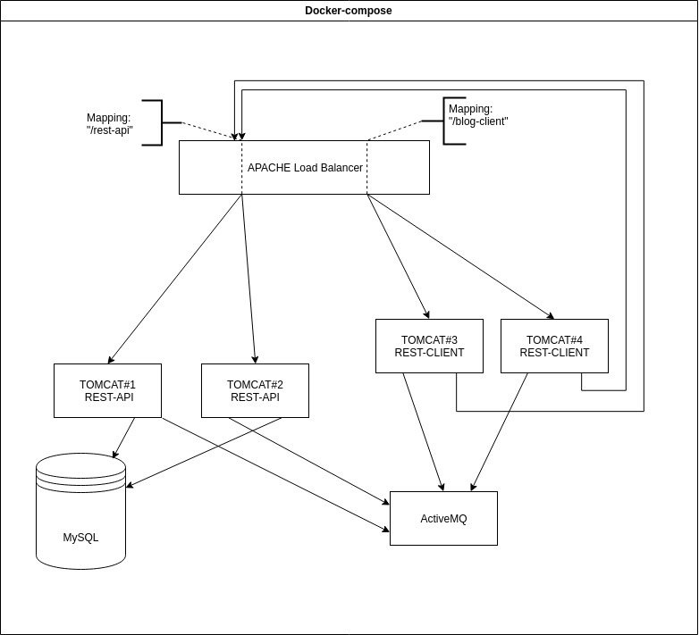

# How setup docker-compose:

If you want to quickly deploy a real environment, you can use the files in the [dockerFiles](../dockerFiles) .
### Necessary tools:
* [Docker](https://docs.docker.com/install/linux/docker-ce/ubuntu/). 
* [Docker-compose](https://docs.docker.com/compose/install/).

## Version 1 (Tomcat + MySQL + ActiveMQ):
### Custom settings: 
All configuration files are located in the corresponding [DataBaseSetup](../dockerFiles/version1/dbSetup), [ActiveMQSetup](../dockerFiles/version1/activeMQSetup) and [tomcatSetup](../dockerFiles/version1/tomcatSetup).

You can configure tomcat-users. To do this, open the [tomcat-users.xml](../dockerFiles/version1/tomcatSetup/tomcat-users.xml) file and create a user for yourself.

In the [context.xml](../dockerFiles/version1/tomcatSetup/context.xml) file, you can configure access to tomcat for different ip addresses.

The script for initializing the database is located in the [DataBaseSetup](../dockerFiles/version1/dbSetup).

### Install:
When everything is ready, go to the [dockerFiles](../dockerFiles/version1), open the terminal and execute the following command:
>**Note**: Make sure that you have free ports: 
* 8888 - you will have access to tomcat through it.
* 61613 - you will have access to activeMq via this port.
* 8161 - you will have access to web-interface activeMQ to manage queues, consumers and producers. 
```
docker-compose build
docker-compose run -p 8888:8080 -p 61613:61613 app
```
### Break containers:
If you want to break the environment, run the following commands:
>**Note**: when you close the environment, all data will be deleted!
```
 docker-compose rm -vf
```
Using the command you can kill the containers:
```
docker rm -f yam_tomcat
docker rm -f yam_activeMQ
docker rm -f yam_mysql
```

## Version 2 (Apache load balancer + MySQL + ActiveMQ + 4 instances of Tomcat):
### Interaction scheme:

### Custom settings: 
All configuration files are located in the corresponding 
[DataBaseSetup](../dockerFiles/version2/dbSetup), 
[ActiveMQSetup](../dockerFiles/version2/activeMQSetup), 
[tomcatSetup1](../dockerFiles/version2/tomcatSetupInstance1),
[tomcatSetup2](../dockerFiles/version2/tomcatSetupInstance2),
[tomcatSetup3](../dockerFiles/version2/tomcatSetupInstance3),
and [tomcatSetup4](../dockerFiles/version2/tomcatSetupInstance4).

You can configure tomcat-users .
To do this, open the tomcat-users.xml in (/tomcatSetupInstance{N}/tomcatData/tomcat-users.xml) file and create a user for yourself.

In the context.xml (tomcatSetupInstance{N}/tomcatData/context.xml) file, you can configure access to tomcat for different ip addresses.
>{N} is tomcat instance number.

The script for initializing the database is located in the [DataBaseSetup](../dockerFiles/version2/dbSetup).

### Install:
When everything is ready, go to the [dockerFiles](../dockerFiles/version2), open the terminal and execute the following command:
>**Note**: Make sure that you have free ports: 
* 8888 - you will have access to first tomcat instance through it.
* 8881 - yot will have access to second tomcat instance through it.
* 8883 - you will have access to third tomcat instance through it.
* 8884 - yot will have access to fourth tomcat instance through it.
* 61613 - you will have access to activeMq via this port.
* 8161 - you will have access to web-interface activeMQ to manage queues, consumers and producers. 
* 5555 - apache load balancer.
```
docker-compose build
docker-compose run -dT --name apache --service-ports apache
```
>*Node*: If you want to deploy applications ([rest][1] and [client][2]) on this interaction scheme, you can deploy every app on two instances.
All static data is rendered on apache for faster capture of this data, so do not forget to copy them to apache when updating them in [client][2].
* 8888 and 8881 ports for [rest-api][1].
* 8883 and 8884 ports for [blog-client][2].
### Break containers:
If you want to break the environment, run the following commands:
>**Note**: when you close the environment, all data will be deleted!
```
 docker-compose rm -vf
```
Using the commands you can remove the containers:
```
docker rm -f yam_tomcat_1-th_instance
docker rm -f yam_tomcat_2-th_instance
docker rm -f yam_tomcat_3-th_instance
docker rm -f yam_tomcat_4-th_instance
docker rm -f yam_mysql
docker rm -f yam_activeMQ
docker rm -f apache
```
Using the commands you can to restart environment:
```
docker-compose rm -vf
docker rm -f yam_tomcat_1-th_instance
docker rm -f yam_tomcat_2-th_instance
docker rm -f yam_tomcat_3-th_instance
docker rm -f yam_tomcat_4-th_instance
docker rm -f yam_mysql
docker rm -f yam_activeMQ
docker rm -f apache
docker-compose build
docker-compose run -dT --name apache --service-ports apache
docker logs apache
```

[1]: https://github.com/JavaBraveWarriors/BlogRest
[2]: https://github.com/JavaBraveWarriors/blog-client