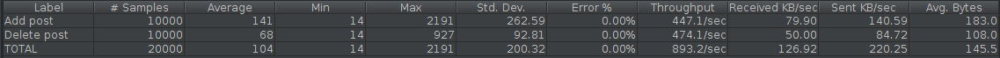
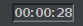
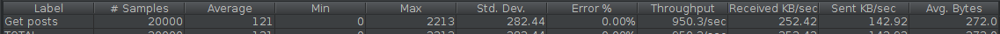

### Performance tests:
#### 1) Add-delete post test

[Test case.](../performanceTests/add_delete_post.jmx)

We set it up so that it sends a post request to the server, then using the post-processor gets the id of the created post from the response via regexp, then a request is sent to delete this post.
Test data:
* Count of users = 10000
* Count of requests = 2
* Ramp-Up period = 1 sec
#### Results:

#### Processing time 20,000 requests: 

#### 2) Get posts test

[Test case.](../performanceTests/get_posts.jmx)

In this case, we use GET-request to the server. We send requests for getting a list of posts(This is most heavy operation).
Test data:
* Count of users = 20000
* Count of requests = 1
* Ramp-Up period = 1 sec
#### Results:

#### Processing time 20,000 requests: 

This is a good result, because in the worst case, this request was processed in 3692 milliseconds.

#### 3) Get tags test

[Test case.](../performanceTests/get_tags.jmx)

In this case, we tested the speed of service requests for getting the tag. 

Test data:
* Count of users = 20000
* Count of requests = 1
* Ramp-Up period = 1 sec
#### Results:

#### Processing time 20,000 requests: 

#### 4) Wave test

[Test case.](../performanceTests/wave_test_posts.jmx)

In this test case, we sent 30,000 requests to view a post with the effect of the wave, that is, by the increasing activity of requests, request mapping: "/blog/posts/{post_id}".
Test data:
* Count of users = 30000
* Count of requests = 1
* Ramp-Up period = 60 sec

#### Results:

#### Processing time 30,000 requests with wave effect: 
