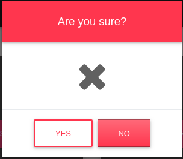

## Introduction
It is required to create a working prototype of a Web application for working with users and publications.
The application must implement the [functions][1].

## 1. Tag
#### 1.1 View Tag List
This program mode is intended for viewing a list of tags.

The main scenario:

* The user selects the "Tags" menu item.
* A list of all tags is displayed.

The list shows the following columns:
* Tags - the name of the tag in the system;
* The number of publications with this tag.

#### 1.2 Adding tag.
The main scenario:
* The user, being in the mode of viewing the list of tags, presses the "Add" button;
* A form for adding a new tag is displayed;
* The user enters the data and clicks the "Save" button;
* If the data is entered incorrectly, the corresponding message is displayed to the user;
* If the data is correct, the tag is added to the database;
* If there was an error saving the data, an error message is displayed;
* If the role is successfully added, the form of viewing the list of roles with the updated data opens.

Cancellation scenario:
* The user, being in the mode of viewing the list of tags, clicks the "Add" button;
* Displays the form of adding the tag;
* User enters data and presses the "Back" button;
* The data is not saved to the database and the tag list view page opens.

When adding a tag, the following details are entered:

* Name of tag;
* Item loading image
#### 1.3 Tag editing.
The main scenario:
* The user, while in the tag list viewing mode, clicks the "Edit" button in the row of the selected tag;
* An edit form is displayed;
* The user changes the data and presses the "Save" button;
* If the data is entered incorrectly, the corresponding message is displayed to the user;
* If the data is correct, the database is updated;
* If there was an error saving the data, an error message is displayed;
* If the tag is successfully updated, a form for viewing the list of tags with updated data opens.

Cancellation scenario:
* The user, being in the mode of viewing the list of tags, clicks the "Edit" button in the row of the selected tag;
* A tag editing form is displayed;
* The user enters data and presses the "Back" button;
* The data is not saved to the database and the tag list view page opens.

#### 1.4 Removing a tag
The main scenario:
* The user, while in the tag list view mode, clicks the "Delete" button in the row of the selected role;
* There is a check on the possibility of deletion;
* If this tag cannot be removed, then a corresponding message is displayed;
* If the tag can be removed, the user is asked to confirm the action;
* User clicks 'Yes';
* The tag is deleted in the database;
* If an error occurred during deletion, the corresponding message is displayed;
* If the tag is deleted successfully, the form of viewing tags with the updated data opens.

Cancellation scenario:
* The user, being in the mode of viewing the list of tags, clicks the "Delete" button in the row of the selected tag;
* A dialog box is displayed;
* User clicks 'No';
* The tag viewer page with not updated data opens.

## 2. Post

#### 2.1 View the list of posts
The main scenario:
The user selects the menu item "posts"
Displaying the form for viewing the list of all posts. List of all posts
In the list of posts the following columns:

* Number of names - the number of unique names in the system;
* Posts total - the total number of posts;
* Tags - post tags;
* Date of adding - the date of adding the post to the system;
* Number - the number of posts;

Filtration
Data was added to view the list of posts. The start date of the filter should not be greater than the final one.

To view the list of all posts, you need to select the tag name in the corresponding section. By default, posts with all tags are displayed.
Refresh button.

#### 2.2 Adding posts
The main scenario:
* The user clicks the "Add" button;
* Display the form for adding a new post;
* The user enters data and clicks "Add";
* If the data is entered incorrectly, a message will be displayed to the user;
* If the post is successfully added, a list of its posts will open.

Cancellation scenario:
* The user clicks the "Add" button;
* Display the form of adding goods;
* The user enters data and presses the "Back" button;
* Data not updated data in the database.

When adding a post, the following details are entered:

The name of the post - the title of the post in the system;
Post tags - post tags are selected.
Text - post message.
Links - links to resources.

#### 2.3 Editing post
The main scenario:
* The user clicks the "Edit" button in the selected post;
* An edit form is displayed;
* The user changes the data and clicks the "Edit" button;
* If the post is successfully updated, a form for viewing the list of posts with updated data will open.
Cancellation scenario:
* The user clicks the "Edit" button in the selected post;
* The user enters data and presses the "Back" button;
* Data not updated data in the database.

When editing, the same fields are shown as in the adding of the post.

#### 2.4 Deleting a post

The main scenario:
* The user clicks the "Delete" button in the selected post;
* Display confirmation dialog for deletion;
* User clicks 'Yes';
* The post is deleted in the database;
* If the post is deleted successfully, the page for viewing posts with updated data will open.

Cancellation scenario:
* The user clicks the "Delete" button in the selected post;
* A dialog box is displayed;
* User clicks 'No';
* Data not updated data in the database.

[1]: TechnicalTask.md